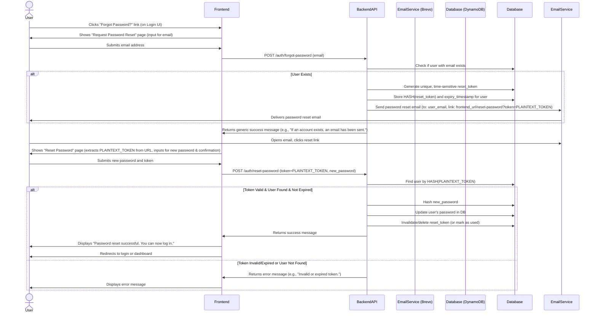

# Feature Plan: Forgot Password

## 1. Overview

This document outlines the plan to implement a "Forgot Password" feature for the web application. This feature will allow users who have forgotten their password to securely reset it via an email-based verification process.

## 2. Core Workflow



## 3. Backend Implementation (FastAPI)

### 3.1. Database Changes (DynamoDB - `backend/app/utils/dynamo_client.py`)

*   **Modify User Item:** Add new attributes to the user item in DynamoDB:
    *   `reset_token_hash`: (String) Stores the bcrypt hash of the password reset token.
    *   `reset_token_expiry`: (Number) Stores the Unix timestamp (UTC) when the token expires.
*   **Rationale for Hashing Token:** Storing a hash of the reset token instead of the plaintext token in the DB is a security best practice. The plaintext token is only in the email link and sent back by the user.

### 3.2. Environment Variables (`backend/.env` and `backend/.env.example`)

*   `BREVO_API_KEY`: Your Brevo API key (already discussed).
*   `FRONTEND_BASE_URL`: The base URL of your frontend application (e.g., `https://yourapp.amplifyapp.com` or `http://localhost:5173` for local dev). Used to construct the reset link.
*   `PASSWORD_RESET_TOKEN_EXPIRE_MINUTES`: (e.g., `60` for 1 hour).
*   `JWT_SECRET_KEY`: (Critical) Move the current hardcoded `SECRET_KEY` from `backend/app/utils/auth.py` to this environment variable.

### 3.3. New Utility Functions (`backend/app/utils/auth.py` or a new `token_utils.py`)

*   **`generate_password_reset_token() -> (str, str)`:**
    *   Generates a cryptographically secure random string (e.g., using `secrets.token_urlsafe(32)`) for the plaintext token.
    *   Hashes this plaintext token using `pwd_context.hash()` (from `dynamo_client.py`).
    *   Returns both the plaintext token (to be emailed) and the hashed token (to be stored).
*   **`verify_password_reset_token(plaintext_token: str, hashed_token_from_db: str) -> bool`:**
    *   Uses `pwd_context.verify(plaintext_token, hashed_token_from_db)`.

### 3.4. Email Sending Utility (`backend/app/utils/email_client.py`)

*   Implement `send_password_reset_email(recipient_email: str, user_name: str, reset_link: str) -> bool` as previously discussed, using the Brevo SDK.
    *   Sender Email: `pphvyyr8xh@privaterelay.appleid.com` (or a custom verified sender if set up later).
    *   Sender Name: Your application name.
    *   The `reset_link` will be `f"{FRONTEND_BASE_URL}/reset-password?token={plaintext_token}"`.

### 3.5. Pydantic Schemas (`backend/app/schemas/auth.py`)

*   **`ForgotPasswordRequest(BaseModel)`:**
    *   `email: EmailStr`
*   **`ResetPasswordRequest(BaseModel)`:**
    *   `token: str` (the plaintext token from the email link)
    *   `new_password: str = Field(..., min_length=6)` (or your password policy)

### 3.6. New API Endpoints (`backend/app/routers/auth.py`)

*   **`POST /auth/forgot-password`**
    *   **Request Body:** `ForgotPasswordRequest`
    *   **Logic:**
        1.  Validate input email.
        2.  Call `get_user_by_email(email)` from `dynamo_client.py`.
        3.  If user exists:
            a.  Generate plaintext token and hashed token using `generate_password_reset_token()`.
            b.  Calculate expiry timestamp (`datetime.utcnow() + timedelta(minutes=PASSWORD_RESET_TOKEN_EXPIRE_MINUTES)`).
            c.  Update the user item in DynamoDB (via a new function in `dynamo_client.py`, e.g., `set_password_reset_token(email, token_hash, expiry_timestamp)`):
                *   Set `reset_token_hash` to the hashed token.
                *   Set `reset_token_expiry` to the expiry timestamp.
            d.  Construct the `reset_link`.
            e.  Call `send_password_reset_email()`. Log success/failure of email sending.
        4.  Return a generic `200 OK` response (e.g., `{"message": "If an account with that email exists, a password reset link has been sent."}`) regardless of whether the user was found or email sent, to prevent email enumeration.
*   **`POST /auth/reset-password`**
    *   **Request Body:** `ResetPasswordRequest`
    *   **Logic:**
        1.  Validate `new_password` strength if not handled by Pydantic.
        2.  **Crucial:** This endpoint needs a way to find the user based on the plaintext token. Since we store the hash, we cannot directly query by the plaintext token.
            *   **Option A (Simpler, less ideal for large scale):** Iterate through users who have a `reset_token_hash` (requires a GSI on `reset_token_hash` if you want to query, or scan if small user base - scan not recommended for production). This is complex.
            *   **Option B (Better): Modify `get_user_by_email` or create a new lookup.** The token itself doesn't directly identify the user without an initial lookup. The common pattern is that the token is associated with a user ID.
            *   **Revised Approach for Token Handling:**
                *   When `POST /auth/forgot-password` is called, the `user_email` is known.
                *   The `reset_token_hash` and `reset_token_expiry` are stored directly on the user item identified by `USER#{user_email}`.
                *   The `POST /auth/reset-password` endpoint will need the `email` as well, or the token itself needs to be self-contained (e.g., a JWT containing the user email and an expiry, signed by the server - this is more complex than a simple opaque token).
                *   **Let's simplify: The reset link can contain the email (URL-encoded) as another query parameter, or the frontend can ask for the email again on the reset page if the token alone isn't enough to identify the user without scanning.**
                *   **Recommended Simplification:** The `token` sent in the email is opaque. The `POST /auth/reset-password` endpoint will receive this `token`. The backend will then need to find a user whose `reset_token_hash` matches `hash(token)`. This requires a GSI on `reset_token_hash` for efficient lookup.
                    *   **Alternative for `reset-password` lookup (if GSI on `reset_token_hash` is undesirable):**
                        *   The reset link could be `/reset-password?user_id={user_email_or_id}&token={token}`.
                        *   The `POST /auth/reset-password` endpoint would then take `user_id` and `token`.
                        *   Fetch user by `user_id`.
                        *   Verify `hash(token)` against stored `reset_token_hash`.
                        *   This approach is more direct for lookup. Let's proceed with this. The `user_id` here will be the email.
        3.  **Revised `POST /auth/reset-password` Logic (assuming link is `/reset-password?email={email}&token={token}`):**
            *   **Request Body:** `ResetPasswordRequest` should also include `email: EmailStr`.
            *   Fetch user by `email` using `get_user_by_email()`.
            *   If user not found, or `user.reset_token_hash` is not set, or `user.reset_token_expiry` is not set: return `400 Bad Request` ("Invalid request or token not initiated.").
            *   Verify the provided `token` against `user.reset_token_hash` using `pwd_context.verify(request.token, user.reset_token_hash)`.
            *   If verification fails: return `400 Bad Request` ("Invalid token.").
            *   Check if `datetime.utcnow().timestamp() > user.reset_token_expiry`: return `400 Bad Request` ("Token expired.").
            *   If all checks pass:
                a.  Hash the `new_password` using `hash_password()`.
                b.  Update the user's `hashed_password` in DynamoDB (via `dynamo_client.py` function, e.g., `update_user_password(email, new_hashed_password)`).
                c.  Clear `reset_token_hash` and `reset_token_expiry` for the user in DynamoDB (important for one-time use).
                d.  Return `200 OK` (e.g., `{"message": "Password reset successfully."}`).
        4.  If any step fails, return appropriate `400` or `401` HTTPExceptions.

### 3.7. Updates to `backend/app/utils/dynamo_client.py`

*   **`set_password_reset_token(email: str, token_hash: str, expiry_timestamp: int)`:**
    *   Updates the user item with `PK=USER#{email}, SK=PROFILE_SUFFIX`.
    *   Sets `reset_token_hash = token_hash` and `reset_token_expiry = expiry_timestamp`.
*   **`update_user_password(email: str, new_hashed_password: str)`:**
    *   Updates the user item's `hashed_password` attribute.
*   **`clear_password_reset_token(email: str)`:**
    *   Removes `reset_token_hash` and `reset_token_expiry` attributes from the user item. This should be called after successful password update.

## 4. Frontend Implementation (React & TypeScript)

### 4.1. New Routes (`frontend/src/App.tsx`)

*   Add two new public routes:
    *   `<Route path="/forgot-password" element={<ForgotPasswordPage />} />`
    *   `<Route path="/reset-password" element={<ResetPasswordPage />} />` (This page will expect `email` and `token` query params if we go with that backend approach).

### 4.2. Modify `AuthModal.tsx` (`frontend/src/components/AuthModal.tsx`)

*   Under the password input field in the login form section, add a link:
    ```html
    <div class="text-sm text-right">
      <button
        type="button"
        onClick={() => {
          onOpenChange(false); // Close current modal
          navigate('/forgot-password');
        }}
        className="font-medium text-blue-600 hover:text-blue-500"
      >
        Forgot your password?
      </button>
    </div>
    ```
    (This button will navigate to the new `/forgot-password` page).

### 4.3. New Page: `ForgotPasswordPage.tsx` (`frontend/src/pages/ForgotPasswordPage.tsx`)

*   **UI:**
    *   Simple page with a title (e.g., "Forgot Your Password?").
    *   Instructions (e.g., "Enter your email address and we'll send you a link to reset your password.").
    *   An email input field.
    *   A "Send Reset Link" submit button.
    *   A link to go back to the login page/modal.
    *   Display area for success/error messages (e.g., using `toast`).
*   **Logic (`react-hook-form` + `zod` for validation):**
    *   Form schema: `email: z.string().email()`.
    *   On submit:
        1.  Set loading state.
        2.  Call a new API function (see 4.5) `requestPasswordReset(email)`.
        3.  On success: Display a generic success message (e.g., "If an account with that email exists, a password reset link has been sent. Please check your inbox.").
        4.  On error: Display an error message (though the backend should always return generic success for this endpoint).
        5.  Clear loading state.

### 4.4. New Page: `ResetPasswordPage.tsx` (`frontend/src/pages/ResetPasswordPage.tsx`)

*   **UI:**
    *   Title (e.g., "Reset Your Password").
    *   Input field for "New Password".
    *   Input field for "Confirm New Password".
    *   A "Reset Password" submit button.
    *   Display area for success/error messages.
*   **Logic (`react-hook-form` + `zod` for validation):**
    *   Form schema:
        *   `newPassword: z.string().min(6, ...)`
        *   `confirmPassword: z.string()`
        *   `.refine(data => data.newPassword === data.confirmPassword, { message: "Passwords don't match", path: ["confirmPassword"] })`
    *   On component mount (`useEffect`):
        1.  Extract `token` and `email` (if using that approach) from URL query parameters (`useSearchParams` from `react-router-dom`).
        2.  If `token` (or `email`) is missing, display an error or redirect (e.g., "Invalid reset link.").
    *   On submit:
        1.  Set loading state.
        2.  Call a new API function (see 4.5) `resetPassword(token, email, newPassword)`.
        3.  On success:
            *   Display success message (e.g., "Password has been reset successfully! You can now log in.").
            *   Redirect to the login page/modal or automatically log the user in if desired (auto-login is more complex).
        4.  On error (e.g., invalid/expired token): Display the error message from the API.
        5.  Clear loading state.

### 4.5. New API Functions (`frontend/src/lib/auth.ts` or a new `passwordResetService.ts`)

*   **`async function requestPasswordReset(email: string): Promise<void>`**
    *   Makes a `POST` request to `${API_URL}/auth/forgot-password` with `{ email }`.
    *   Handles API response (though it will always be a generic success from backend).
*   **`async function resetPassword(token: string, email: string, newPassword: string): Promise<void>`**
    *   Makes a `POST` request to `${API_URL}/auth/reset-password` with `{ token, email, new_password: newPassword }`.
    *   Throws an error if the API returns an error status, so the UI can catch and display it.

### 4.6. UI Feedback

*   Use the existing `Toaster` component or similar mechanisms to provide feedback to the user (e.g., "Reset link sent," "Password updated," "Invalid token").

## 5. Email Template

*   **Content:**
    *   Clear subject line (e.g., "Reset Your Password for [Your App Name]").
    *   Personalized greeting (e.g., "Hi [User Name]," - if name is available, otherwise "Hi there,").
    *   Statement that a password reset was requested.
    *   The unique password reset link (button or plain link).
    *   Mention of token expiry (e.g., "This link is valid for 1 hour.").
    *   Instruction on what to do if they didn't request the reset (e.g., "If you didn't request this, please ignore this email.").
    *   Closing and app name.
*   **Styling:** Keep it simple and professional. Ensure it's mobile-responsive. Brevo provides tools for creating/managing templates.

## 6. Security Considerations & Best Practices

*   **HTTPS:** Ensure all communication is over HTTPS.
*   **Secure Token Generation:** Use cryptographically secure random strings for reset tokens.
*   **Token Hashing in DB:** Store hashes of reset tokens, not plaintext.
*   **Token Expiry:** Implement and enforce short expiry times for reset tokens.
*   **One-Time Use Tokens:** Ensure reset tokens are invalidated immediately after successful use (by clearing `reset_token_hash` and `reset_token_expiry` from the user item).
*   **Rate Limiting:** Apply rate limiting to the `/auth/forgot-password` endpoint on the backend to prevent abuse (e.g., an attacker trying to flood users with reset emails or discover accounts). This can be done with FastAPI middleware or a service like AWS WAF if applicable.
*   **Prevent Email Enumeration:** The `/auth/forgot-password` endpoint should always return a generic success message.
*   **Input Validation:** Rigorous validation on both frontend and backend for all inputs (email formats, password complexity, token format).
*   **Inform User of Password Changes:** Optionally, after a password has been successfully reset, send a separate notification email to the user informing them of this action for security awareness.
*   **CSRF Protection:** Ensure standard CSRF protection mechanisms are in place for your FastAPI backend if forms are submitted in a way that's vulnerable (FastAPI has some built-in protections, but review).
*   **JWT Secret Key:** Move the `SECRET_KEY` to an environment variable and ensure it's strong.

## 7. Testing Strategy

*   **Backend Unit Tests:**
    *   Test token generation and hashing.
    *   Test `forgot-password` endpoint logic (user found, user not found, email sending mock).
    *   Test `reset-password` endpoint logic (valid token, invalid token, expired token, successful password update).
    *   Test DynamoDB utility functions.
*   **Frontend Unit/Component Tests:**
    *   Test `ForgotPasswordPage` form validation and submission.
    *   Test `ResetPasswordPage` form validation, token/email extraction, and submission.
    *   Test API service calls.
*   **End-to-End (E2E) Tests:**
    *   Simulate the full flow: user requests reset, clicks link (mock email interaction), resets password, logs in with new password.
    *   Test invalid/expired token scenarios.

## 8. Deployment Considerations

*   Ensure all new environment variables are set in your deployment environments (AWS Amplify, backend hosting).
*   Verify Brevo sending configuration in the production environment.
*   Monitor logs for any issues post-deployment.

This plan provides a comprehensive guide for implementing the "Forgot Password" feature.